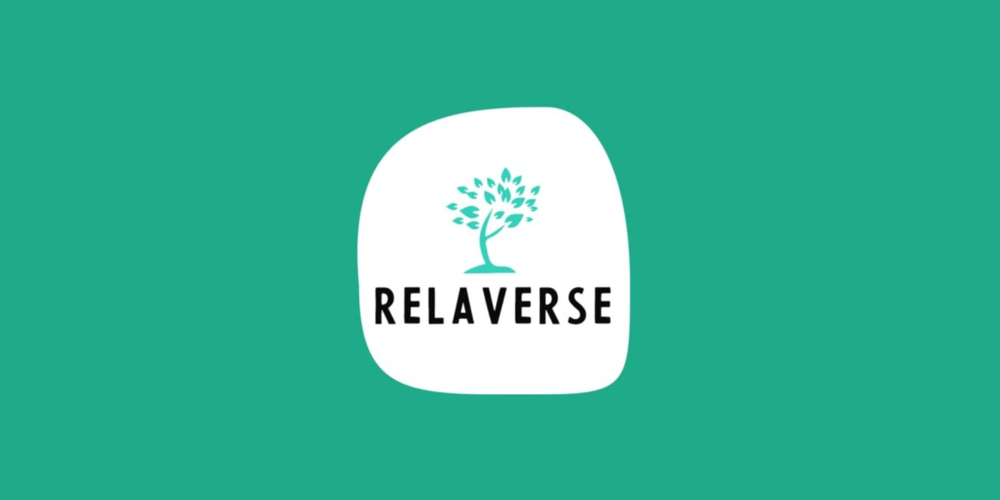

<!-- Add banner here -->
<p align="center">
  
</p>

# **Title Classification - RelaVerse (Machine Learning)**

<!-- Button and Banner-->

<!-- Describe your project in brief -->
Creating a model using TensorFlow.js and natural language processing (NLP) in its implementation. The dataset used is divided into train and test sets, with an 80% proportion for training and 20% for testing. In the preprocessing stage, the stopwords function is used to determine words to be avoided in the NLP process. Then, stemming function is applied to break down words in the campaign titles into their base form. After that, tokenizer is used to separate words in the campaign titles for further text analysis. Next, in the modeling stage, tf.keras.Sequential is used. Finally, the model is converted to model.json using tensorflow.js.

# **Quickstart/Demo**

<!-- Add a demo for your project -->
For quickstart demo, you can use this button to go to google colab for launch the classification model.

<!-- Colab Button -->
[](https://colab.research.google.com/drive/1gbMtyJSmh6BhPgJ3zS7tA0QUe0cYTJuA?hl=id#scrollTo=XWnCAHqSyuTx)

# **Table of Contents**

It is a long established fact that a reader will be distracted by the readable content of a page when looking at its layout. The point of using Lorem Ipsum is that it has a more-or-less normal distribution of letters, as opposed to using 'Content here, content here', making it look like readable English.

- [Project Title](#title-classification---relaverse-machine-learning)
- [Quickstart/Demo](#quickstartdemo)
- [Table of Contents](#table-of-contents)
- [Installation](#installation)
- [License](#license)
- [Team Member](#team-member)
- [Repository](#repository)

# **Installation** 
[(Back to Top)](#table-of-contents)

This is where your installation instructions go.
You can add snippets here that your readers can copy-paste with click:

```shell
git clone https://github.com/NgakanWidyasprana/RelaVerse-ML
```

After you clone, you can run the jupiter notebook (*download jupiter first*) :

```shell
ipython notebook "python/Text_Classification.ipynb"
```

or

```shell
jupyter notebook "python/Text_Classification.ipynb"
```

This will open the Jupyter Notebook software and project file in your browser.

This project requires **Python** and the following Python libraries installed:

- [NumPy](http://www.numpy.org/)
- [Pandas](http://pandas.pydata.org/)
- [matplotlib](http://matplotlib.org/)
- [scikit-learn](http://scikit-learn.org/stable/)
- [tensorflow](https://www.tensorflow.org/install/pip)
- [nltk](https://www.nltk.org/)
- [Sastrawi](https://pypi.org/project/Sastrawi/)

# Team Member
[(Back to top)](#table-of-contents)

|              Name              | Bangkit-ID |   Learning Path    |                                                       Contact Link                                                       |
| :----------------------------: | :--------: | :----------------: | :----------------------------------------------------------------------------------------------------------------------: |
| Jason Suhali | M264DSX1746 |  Machine Learning  |            [LinkedIn](https://www.linkedin.com/in/jason-suhali-604814222/)  and [GitHub](https://github.com/JasonXander)         |
|   Ngakan Putu Widyasprana     | M368DSX3659 |  Machine Learning  |                [LinkedIn](https://www.linkedin.com/in/ngakanwp/)    and [GitHub](https://github.com/NgakanWidyasprana)            |
|     Kristian Ekachandra            | A264DSX2268| Mobile Development |              [LinkedIn](https://www.linkedin.com/in/kristian-ekachandra/)       and [GitHub](https://github.com/KristianEka)        |
|     Mohammad Faiz Azhary     | A363DSX1260 | Mobile Development |    [LinkedIn](https://www.linkedin.com/in/mohammad-faiz-azhary/)  and [GitHub](https://github.com/zee-azha)    |
|      Muhammad Aimar Rizki Utama     |C360DSX0650 |  Cloud Computing   | [LinkedIn](https://www.linkedin.com/in/muhammad-aimar-rizki-utama-75479b21b/) and [GitHub](https://github.com/aimrzky)   |
|        Fakhrity Hikmawan         | C360DSX1665 |  Cloud Computing   |        [LinkedIn](https://www.linkedin.com/in/fakhrity-hikmawan/)   and [GitHub](https://github.com/fahixa)     |

# Repository
[(Back to top)](#table-of-contents)

|   Learning Paths   |                                Link                                |
| :----------------: | :----------------------------------------------------------------: |
| Mobile Development | [Github](https://github.com/zee-azha/Relaverse) |
| Cloud Computing  | [Github](https://github.com/aimrzky/Relaverse-CC)  |
| Machine Learning  | [Github](https://github.com/NgakanWidyasprana/RelaVerse-ML/tree/main)  |

# License
[(Back to top)](#table-of-contents)

Bangkit Team C23-PS235