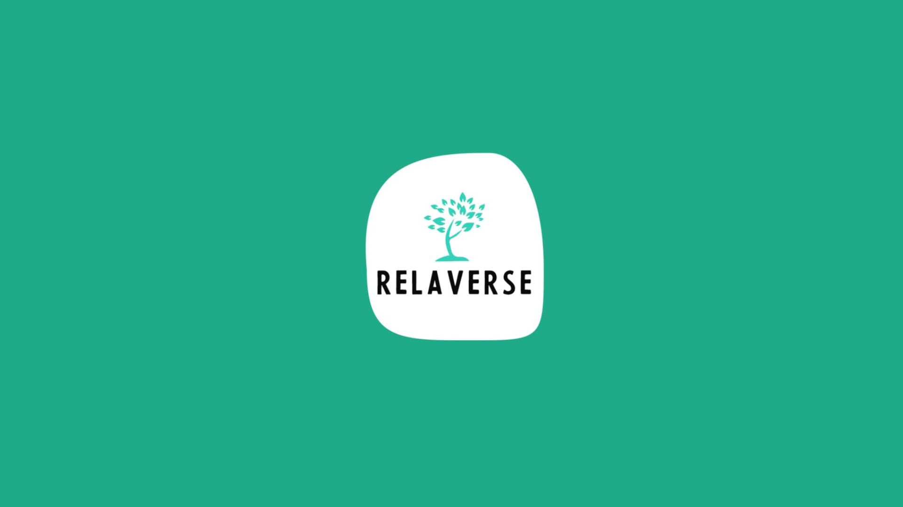

<!-- Add banner here -->
<p align="center">
  
</p>

# **Title Classification - RelaVerse**

<!-- Button and Banner-->

<!-- Describe your project in brief -->
It is a long established fact that a reader will be distracted by the readable content of a page when looking at its layout. The point of using Lorem Ipsum is that it has a more-or-less normal distribution of letters, as opposed to using 'Content here, content here', making it look like readable English. Many desktop publishing packages and web page editors now use Lorem Ipsum as their default model text, and a search for 'lorem ipsum' will uncover many web sites still in their infancy. Various versions have evolved over the years, sometimes by accident, sometimes on purpose (injected humour and the like).

# **Quickstart/Demo**

<!-- Add a demo for your project -->
I believe that you should bring value to the reader as soon as possible. You should be able to get the user up and running with your project with minimal friction.
If you have a quickstart guide, this is where it should be.
Alternatively, you can add a demo to show what your project can do.

<!-- Colab Button -->
[](https://github.com/NgakanWidyasprana/RelaVerse-ML/blob/main/python/Text_Classification.ipynb)

# Table of Contents

GitHub has a ToC feature now. It works really well, so this might not be needed. Still, if you want to add a ToC in the README, you can add it here.
I just learned that VS Code automatically updates the ToC if you change any of the headings. Pretty cool!

- [Project Title](#project-title)
- [Quickstart/Demo](#quickstartdemo)
- [Table of Contents](#table-of-contents)
- [Installation](#installation)
- [Usage](#usage)
- [Development](#development)
- [Contribute](#contribute)
- [License](#license)

# Installation
[(Back to top)](#table-of-contents)

This is where your installation instructions go.
You can add snippets here that your readers can copy-paste with click:

```shell
gh repo clone navendu-pottekkat/awesome-readme
```

# Usage
[(Back to top)](#table-of-contents)

Next, you have to explain how to use your project. You can create subsections under here to explain more clearly.

# Development
[(Back to top)](#table-of-contents)

You have people who want to use your project and then you have people who want contribute to your project.
This is where you provide instructions for the latter.
Add instructions on how to set up a development environment, clone, and build the project.
You can use the code snippets here as well:

```shell
command to clone your project
command to build your project
command to run your project in development mode
```

# Contribute
[(Back to top)](#table-of-contents)

You can use this section to highlight how people can contribute to your project.
You can add information on how they can open issues or how they can sponsor the project.

# License
[(Back to top)](#table-of-contents)

You can also mention what license the project uses. I usually add it like this:

[MIT license](./LICENSE)